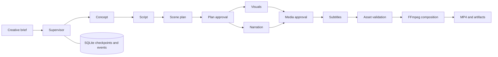

# FrameForge — Agentic AI Video Generation Pipeline

A portfolio project that takes a creative brief through a supervised video workflow: concept, script, scene planning, visuals, narration, subtitles, validation, and MP4 composition. A browser dashboard shows stage progress, review checkpoints, generated artifacts, and job events.

The project offers a complete **demo mode** without API keys and a configurable **live mode** using OpenAI for planning, images, and speech. Demo visuals are locally drawn scene cards; demo narration uses offline system speech when available and clearly reports a silent fallback. Live integrations require your own credentials and can incur charges.

## Start on Windows

Requirements: Python 3.11 or newer and FFmpeg available in `PATH`. The Docker option below includes FFmpeg and offline speech.

From this project folder, run:

```powershell
powershell -ExecutionPolicy Bypass -File .\scripts\run.ps1
```

The launcher creates `.venv`, installs the dependencies, copies `.env.example` to `.env` if needed, checks FFmpeg, and starts the app. Open **[http://127.0.0.1:8000](http://127.0.0.1:8000)**. Press `Ctrl+C` to stop it. Later runs can skip dependency installation:

```powershell
.\scripts\run.ps1 -SkipInstall
```

If FFmpeg is installed outside `PATH`, set `FFMPEG_PATH` in `.env` to its full executable path. The launcher does not install system software or change permanent execution policy.

On macOS or Linux, with Python and FFmpeg installed:

```sh
sh scripts/run.sh
```

Installing `espeak` provides offline demo narration on Linux; without a supported speech engine, demo jobs use a silent WAV and report that no spoken narration was generated.

## Start with Docker

With Docker Compose installed, from the project folder:

```powershell
if (-not (Test-Path .env)) { Copy-Item .env.example .env }
docker compose up --build
```

Open [http://127.0.0.1:8000](http://127.0.0.1:8000). The image includes FFmpeg and `espeak`; the named volume preserves the database and media. Stop with `docker compose down`. Removing the named volume also removes saved jobs and media.

Docker configuration is supplied, but Docker was unavailable during local verification, so container builds remain unverified.

## Deploy to Hugging Face Spaces

Create a public or private Space using the **Docker** SDK and upload the project source. The README metadata exposes port 8000, matching the application and health check. The image runs as user 1000, includes FFmpeg, offline speech, and fonts, and gives that user ownership of the runtime data directory. Set `MAX_CONCURRENT_JOBS=1` in Space variables for a small CPU instance.

The account's available plans determine whether Docker hosting can be selected. If the creation page requires PRO, upgrade the account before creating a Docker Space. A static Space can present the UI and an included sample video, but cannot run this FastAPI backend.

Exclude `.env`, local databases, runtime artifacts, virtual environments, and temporary files from uploads. Leave live provider credentials unconfigured for the public demo. Generated jobs and files use ephemeral container storage and may reset when the Space restarts. Hugging Face hosting does not add per-user isolation to this app; visitors share the demo production list and review controls.

The platform requirements are documented in [Docker Spaces](https://huggingface.co/docs/hub/spaces-sdks-docker) and the [Space configuration reference](https://huggingface.co/docs/hub/spaces-config-reference).

## Deploy to Render's free plan

Push the source to a GitHub repository, sign in to Render, and create a **Web Service** from that repository. Choose **Docker** and the **Free** instance. Set the health check to `/api/health` and add `MAX_CONCURRENT_JOBS=1`, `QUEUE_BACKEND=local`, and `PORT=8000` as environment variables. The supplied `render.yaml` records these settings for Blueprint deployment.

The Docker image includes all required media tools and serves both the UI and API. No API key is needed for the local demo workflow. Keep live provider keys unconfigured in a public demo.

Free web services sleep after 15 minutes without incoming traffic, so the first visit can take longer to load. Jobs and media are stored on the ephemeral local filesystem and can be lost on sleep, restart, or redeployment. Download completed videos you want to keep. See [Render's free-plan limits](https://render.com/docs/free).

For a separate API process, worker, and Redis notification service:

```powershell
docker compose --env-file .env -f docs/compose.redis.yml up --build
```

Use either Compose setup at a time because both expose port 8000. Redis sends wake-up hints; SQLite remains the durable source of jobs. This configuration shares one local Docker volume and is intended for a single machine.

## Try a complete demo

1. Enter a brief such as “Create a 24-second explainer about how urban trees cool a city.” Keep **Demo** selected and enable review checkpoints.
2. Submit the job. The supervisor advances through concept, script, and scene planning.
3. At the **plan review**, inspect or edit the script and scene plan, then approve it. If you change the script, also update the scene narration so the plan stays consistent.
4. Inspect visuals and audio at the **media review**, then approve them for composition.
5. Preview or download the final MP4 and inspect the event history and supporting artifacts.

Try a portrait or square video using the aspect ratio control. Jobs accept durations from 12 to 60 seconds. A failed or cancelled job can be retried while preserving completed stage work. Cancelling does not revoke a provider request that has already been sent.

An included [24-second demo MP4](output/demo/agentic-video-demo.mp4) demonstrates the local workflow, both approval checkpoints, edited narration, H.264 video, AAC audio, and captions. Its [manifest](output/demo/manifest.json), [subtitles](output/demo/subtitles.srt), and [verification record](output/demo/verification.json) accompany the sample. The sample uses local illustrated cards and offline speech.

## How it works



In live mode, the supervisor uses Responses API function calling to choose among registered workflow actions. The executor validates dependencies and review gates before running an action. Each stage persists its result, attempts, and timing. Workers lease jobs, renew ownership, and recover expired jobs after a process restart. See [architecture and recovery](docs/architecture.md).

| Capability | Implementation |
| --- | --- |
| Planning and supervision | Structured Responses API outputs and constrained function calls in live mode; deterministic workflow in demo mode |
| Visuals | OpenAI image generation or an optional external video adapter; local scene cards in demo mode |
| Narration | OpenAI speech in live mode; offline speech or a reported silent fallback in demo mode |
| Rendering | FFmpeg composition of scenes, narration, and subtitles into MP4 |
| Human review | Persisted plan and media approval checkpoints |
| Recovery | SQLite checkpoints, job leases, bounded stage retries, up to two media repair rounds, manual retry and cancellation |
| Visibility | Job events, artifact provenance, stage attempts and timings, `/metrics` |
| Queue options | Embedded local worker or separate worker with Redis wake-up notifications |

## API examples

Interactive API documentation is available at [http://127.0.0.1:8000/docs](http://127.0.0.1:8000/docs). Create a job from PowerShell:

```powershell
$body = @{
    brief = "Create a short explainer about how urban trees cool a city."
    title = "A Cooler City"
    duration_seconds = 24
    aspect_ratio = "16:9"
    style = "cinematic"
    provider_mode = "demo"
    review_required = $true
} | ConvertTo-Json

$job = Invoke-RestMethod -Uri "http://127.0.0.1:8000/api/jobs" `
    -Method Post -ContentType "application/json" -Body $body

Invoke-RestMethod "http://127.0.0.1:8000/api/jobs/$($job.id)"
Invoke-RestMethod "http://127.0.0.1:8000/api/jobs/$($job.id)/events"
```

When the job reaches `awaiting_review`, approve its current checkpoint:

```powershell
Invoke-RestMethod -Uri "http://127.0.0.1:8000/api/jobs/$($job.id)/approve" `
    -Method Post -ContentType "application/json" -Body '{}'
```

Approval uses the checkpoint recorded in the job. At plan review, the body may contain `script`, `scenes`, and `notes`; scene IDs must be unique and their durations must total the requested duration within 0.5 seconds. A changed script requires a corresponding scene plan. The media checkpoint accepts approval notes without script or scene edits. An empty body object approves the current content.

| Endpoint | Purpose |
| --- | --- |
| `GET /api/health` | Application readiness information |
| `GET /api/jobs` | Recent jobs, returned as `{ "jobs": [...] }` |
| `POST /api/jobs` | Create a job |
| `GET /api/jobs/{id}` | Job state and stage progress |
| `GET /api/jobs/{id}/events` | Persisted event history |
| `GET /api/jobs/{id}/artifacts` | Generated artifact records |
| `POST /api/jobs/{id}/approve` | Approve or edit the active review checkpoint |
| `POST /api/jobs/{id}/retry` | Retry a failed or cancelled job |
| `POST /api/jobs/{id}/cancel` | Cancel a queued, running, or awaiting-review job |
| `GET /metrics` | Prometheus-format job counts, stage attempts, and durations |

## Configure live generation

Set `OPENAI_API_KEY` in `.env`, restart the app, and select **Live** for the job. Configure `LLM_MODEL`, `IMAGE_MODEL`, `TTS_MODEL`, and `TTS_VOICE` for models your account supports. Model availability and access depend on the provider. The optional `VIDEO_API_URL` uses the contract in [provider integration](docs/provider-contract.md).

The `.env.example` lists storage, concurrency, retries, timeouts, and queue settings. Keep API keys in the server environment. The browser never needs them. The app does not calculate provider billing; stage timings and attempts are observations, not cost estimates.

## Development and operating scope

```powershell
.\.venv\Scripts\python.exe -m pip install -r requirements-dev.txt
.\.venv\Scripts\python.exe -m pytest
```

[GitHub Actions](.github/workflows/ci.yml) runs the tests on Ubuntu with Python 3.12, FFmpeg, and offline speech; provider HTTP tests use mocked responses and require no credentials.

The default service binds to `127.0.0.1`; Docker also publishes only to that interface. This portfolio service has no built-in authentication, user isolation, or production rate limiting. Put an authentication and access-control layer in front of it before exposing it remotely.

Jobs and artifacts are saved under `data/` by default. Keep the database and artifact directory together. Stop the API and workers before copying the runtime directory for a filesystem backup; use a local filesystem for the live database rather than synchronizing it between machines. External generation requests can repeat after a crash before a checkpoint is saved, so recovery provides at-least-once execution rather than exactly-once provider billing.

See [architecture](docs/architecture.md), [provider configuration](docs/provider-contract.md), and [truthful resume bullets and interview walkthrough](docs/resume.md).
