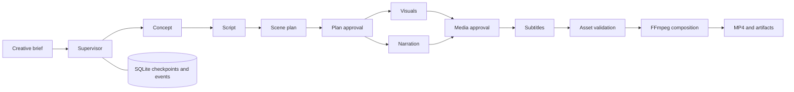

# FrameForge — Agentic AI Video Generation Pipeline

A portfolio project that takes a creative brief through a supervised video workflow: concept, script, scene planning, visuals, narration, subtitles, validation, and MP4 composition. A browser dashboard shows stage progress, review checkpoints, generated artifacts, and job events.

The dashboard starts in **Free studio**: edit a topic-specific storyboard, use free stock footage or upload your own visuals and recordings, add background music, and export an MP4 with gentle fades and natural narration pacing. Optional Gemini integration supplies scripts and neural speech on a Google free-tier project. The included coffee example works without any key.

**Demo** remains available for locally drawn scene cards and offline speech. **Live** uses OpenAI or a configured external video adapter and can incur charges. The API keeps `provider_mode="demo"` as its default for compatibility; select `"free"` explicitly when using the free workflow through the API.

## Start on Windows

Requirements: Python 3.11 or newer and FFmpeg available in `PATH`. The Docker option below includes FFmpeg and offline speech.

From this project folder, run:

```powershell
powershell -ExecutionPolicy Bypass -File .\scripts\run.ps1
```

The launcher creates `.venv`, installs the dependencies, copies `.env.example` to `.env` if needed, checks FFmpeg, and starts the app. Open **[http://127.0.0.1:8000](http://127.0.0.1:8000)**. Press `Ctrl+C` to stop it. Later runs can skip dependency installation:

```powershell
.\scripts\run.ps1 -SkipInstall
```

If FFmpeg is installed outside `PATH`, set `FFMPEG_PATH` in `.env` to its full executable path. The launcher does not install system software or change permanent execution policy.

On macOS or Linux, with Python and FFmpeg installed:

```sh
sh scripts/run.sh
```

Installing `espeak` provides offline demo narration on Linux; without a supported speech engine, demo jobs use a silent WAV and report that no spoken narration was generated.

## Start with Docker

With Docker Compose installed, from the project folder:

```powershell
if (-not (Test-Path .env)) { Copy-Item .env.example .env }
docker compose up --build
```

Open [http://127.0.0.1:8000](http://127.0.0.1:8000). The image includes FFmpeg and `espeak`; the named volume preserves the database and media. Stop with `docker compose down`. Removing the named volume also removes saved jobs and media.

The Render deployment uses this Docker image. Local container testing requires Docker to be installed.

## Deploy to Hugging Face Spaces

Create a public or private Space using the **Docker** SDK and upload the project source. The README metadata exposes port 8000, matching the application and health check. The image runs as user 1000, includes FFmpeg, offline speech, and fonts, and gives that user ownership of the runtime data directory. Set `MAX_CONCURRENT_JOBS=1` in Space variables for a small CPU instance.

The account's available plans determine whether Docker hosting can be selected. If the creation page requires PRO, upgrade the account before creating a Docker Space. A static Space can present the UI and an included sample video, but cannot run this FastAPI backend.

Exclude `.env`, local databases, runtime artifacts, virtual environments, and temporary files from uploads. Leave live provider credentials unconfigured for the public demo. Generated jobs and files use ephemeral container storage and may reset when the Space restarts. Hugging Face hosting does not add per-user isolation to this app; visitors share the demo production list and review controls.

The platform requirements are documented in [Docker Spaces](https://huggingface.co/docs/hub/spaces-sdks-docker) and the [Space configuration reference](https://huggingface.co/docs/hub/spaces-config-reference).

## Deploy to Render's free plan

Push the source to a GitHub repository, sign in to Render, and create a **Web Service** from that repository. Choose **Docker** and the **Free** instance. Set the health check to `/api/health` and add `MAX_CONCURRENT_JOBS=1`, `QUEUE_BACKEND=local`, and `PORT=8000` as environment variables. The supplied `render.yaml` records these settings for Blueprint deployment.

The Docker image includes all required media tools and serves both the UI and API. No API key is needed for uploads, local narration, or the prepared coffee example. Add `PEXELS_API_KEY` for automatic footage search and, optionally, `GEMINI_API_KEY` from a free-tier Google project for AI scripts and narration. Keep paid live-provider credentials unconfigured when running the free portfolio demo.

Free web services sleep after 15 minutes without incoming traffic, so the first visit can take longer to load. Jobs and media are stored on the ephemeral local filesystem and can be lost on sleep, restart, or redeployment. Download completed videos you want to keep. See [Render's free-plan limits](https://render.com/docs/free).

The deployed free instance has 512 MB RAM and 0.1 CPU. Exports stay at 720p landscape/portrait, or 720×720 square, and composition has a 270-second deadline. Start with a 12–24 second production; longer jobs or large uploaded clips may reach that deadline. This service does not run local diffusion or AI video models on Render.

For a separate API process, worker, and Redis notification service:

```powershell
docker compose --env-file .env -f docs/compose.redis.yml up --build
```

Use either Compose setup at a time because both expose port 8000. Redis sends wake-up hints; SQLite remains the durable source of jobs. This configuration shares one local Docker volume and is intended for a single machine.

## Make a video without paid generation

For an immediate example, choose **Try coffee example**. It loads a prepared 16-second Ember & Bean storyboard at media review with existing AI-created coffee stills, Windows Zira narration, and an original score. Review or replace those assets, then approve the export. Loading this example makes no new AI requests and is separate from automatic stock search.

For your own production:

1. Enter a brief, choose **Free studio**, select an aspect ratio and either fades or cuts, then submit. Free studio always uses plan and media reviews.
2. At **plan review**, edit the script and scene subjects. If you change the script, also update the scene narration so they stay consistent. With no Gemini key, planning uses editable topic templates and narration uses the local speech engine.
3. Approve the plan. With `PEXELS_API_KEY` configured, the visual stage searches for relevant real video clips and records contributor/source credits. Without that key, it creates clearly marked draft cards for you to replace.
4. At **media review**, upload photos or clips per scene, replace narration with a recording if desired, and optionally upload background music. Free-mode export requires every draft visual to be replaced with a real asset. Record the same words as the scene narration so the estimated captions match. Review stock-footage relevance and crop before export.
5. Approve the media, then preview or download the final video and its supporting artifacts. Narration stays at its natural recorded pace; the total can grow beyond the requested duration, up to 60 seconds, when speech needs more time.

Visual uploads accept PNG, JPEG, WebP, MP4, or WebM up to 25 MB. Audio uploads accept WAV, MP3, M4A, or OGG up to 15 MB. Narration recordings can be up to 60 seconds each and music up to 300 seconds. Source video clips can be up to 180 seconds; the composer uses the planned scene portion and loops shorter clips. Uploads are inspected and stored under generated filenames.

Requests accept durations from 12 to 60 seconds. If combined narration and short pauses exceed 60 seconds, shorten the script or recordings before exporting. Captions use estimated timing from recording duration; they do not use transcription or word-level alignment. A failed or cancelled job can be retried while preserving completed work. Cancelling does not revoke a provider request already sent.

## How it works



In live mode, the supervisor uses Responses API function calling to choose among registered workflow actions. Free and demo modes choose a dependency-safe action deterministically; optional Gemini handles free-mode content planning and narration. The executor validates dependencies and review gates before running an action. Each stage persists its result, attempts, and timing. Workers lease jobs, renew ownership, and recover expired jobs after a process restart. See [architecture and recovery](docs/architecture.md).

| Capability | Implementation |
| --- | --- |
| Planning and supervision | Gemini structured content planning or editable topic templates in free mode; Responses API planning/function calls in live mode; deterministic action selection in free/demo modes |
| Visuals | Pexels stock clips, uploaded photos/clips, or prepared coffee assets in free mode; local scene cards in demo mode; OpenAI images or an external video adapter in live mode |
| Narration | Uploaded recordings, Gemini speech, or offline system speech in free mode; offline demo speech with a reported silent fallback; OpenAI speech in live mode |
| Rendering | 720p FFmpeg MP4, restrained camera movement, optional fades, normalized natural speech, looped music ducked under narration, and estimated captions |
| Human review | Persisted plan/media approval, per-scene media replacement, and music upload/removal; mandatory in free mode |
| Recovery | SQLite checkpoints, job leases, bounded stage retries, up to two media repair rounds, manual retry and cancellation |
| Visibility | Job events, artifact provenance, stage attempts and timings, `/metrics` |
| Queue options | Embedded local worker or separate worker with Redis wake-up notifications |

## API examples

Interactive API documentation is available at [http://127.0.0.1:8000/docs](http://127.0.0.1:8000/docs). Create a job from PowerShell:

```powershell
$body = @{
    brief = "Create a short explainer about how urban trees cool a city."
    title = "A Cooler City"
    duration_seconds = 24
    aspect_ratio = "16:9"
    style = "cinematic"
    provider_mode = "free"
    review_required = $true
    transition = "fade"
} | ConvertTo-Json

$job = Invoke-RestMethod -Uri "http://127.0.0.1:8000/api/jobs" `
    -Method Post -ContentType "application/json" -Body $body

Invoke-RestMethod "http://127.0.0.1:8000/api/jobs/$($job.id)"
Invoke-RestMethod "http://127.0.0.1:8000/api/jobs/$($job.id)/events"
```

When the job reaches `awaiting_review`, approve its current checkpoint:

```powershell
Invoke-RestMethod -Uri "http://127.0.0.1:8000/api/jobs/$($job.id)/approve" `
    -Method Post -ContentType "application/json" -Body '{}'
```

Approval uses the checkpoint recorded in the job. At plan review, the body may contain `script`, `scenes`, and `notes`; scene IDs must be unique and their durations must total the requested duration within 0.5 seconds. A changed script requires a corresponding scene plan. The media checkpoint accepts approval notes without script or scene edits and fits scene durations to recorded narration before composition. Use the multipart media endpoint while awaiting media review to replace source assets. An empty body object approves the current content.

| Endpoint | Purpose |
| --- | --- |
| `GET /api/health` | Application readiness information |
| `GET /api/jobs` | Recent jobs, returned as `{ "jobs": [...] }` |
| `POST /api/jobs` | Create a job |
| `POST /api/samples/coffee` | Load a prepared coffee job directly at media review |
| `GET /api/jobs/{id}` | Job state and stage progress |
| `GET /api/jobs/{id}/events` | Persisted event history |
| `GET /api/jobs/{id}/artifacts` | Generated artifact records |
| `POST /api/jobs/{id}/approve` | Approve or edit the active review checkpoint |
| `POST /api/jobs/{id}/media` | Multipart `file`, `kind` (visual, voice, music), and `scene_id` for visual/voice |
| `POST /api/jobs/{id}/music/remove` | Remove background music while awaiting media review |
| `POST /api/jobs/{id}/retry` | Retry a failed or cancelled job |
| `POST /api/jobs/{id}/cancel` | Cancel a queued, running, or awaiting-review job |
| `GET /metrics` | Prometheus-format job counts, stage attempts, and durations |

## Configure optional free integrations

Set `PEXELS_API_KEY` in the server environment for automatic stock-video search. Obtain a key from the [Pexels API](https://www.pexels.com/api/). Source/contributor links and license information are retained with assets so credits remain available when reviewing and sharing the production.

For AI-written scripts and neural narration, create a **free-tier** key in [Google AI Studio](https://aistudio.google.com/api-keys), set `GEMINI_API_KEY`, and restart the app. Defaults are `GEMINI_MODEL=gemini-2.5-flash-lite`, `GEMINI_TTS_MODEL=gemini-2.5-flash-preview-tts`, and `GEMINI_TTS_VOICE=Kore`. Google lists free-tier access for these models, subject to account availability and quotas. Keep the Google project on its free tier without enabling billing if you want no charges; an API key or model name cannot enforce an account's billing status. See [Gemini pricing](https://ai.google.dev/gemini-api/docs/pricing).

Free mode uses only allowlisted text and speech models. It makes no paid image, Veo, batch, or search-grounding requests and never switches to OpenAI after a Gemini error. Quota or access failures remain visible so you can retry or use uploaded media. Without either key, uploads and the prepared coffee example still work.

## Configure optional paid live generation

Set `OPENAI_API_KEY` in `.env`, restart the app, and select **Live** for the job. Configure `LLM_MODEL`, `IMAGE_MODEL`, `TTS_MODEL`, and `TTS_VOICE` for models your account supports. Model availability and access depend on the provider. The optional `VIDEO_API_URL` uses the contract in [provider integration](docs/provider-contract.md).

The `.env.example` lists storage, concurrency, retries, timeouts, and queue settings. Keep API keys in the server environment. The browser never needs them. The app does not calculate provider billing; stage timings and attempts are observations, not cost estimates.

## Development and operating scope

```powershell
.\.venv\Scripts\python.exe -m pip install -r requirements-dev.txt
.\.venv\Scripts\python.exe -m pytest
```

[GitHub Actions](.github/workflows/ci.yml) runs the tests on Ubuntu with Python 3.12, FFmpeg, and offline speech; provider HTTP tests use mocked responses and require no credentials.

The local launchers bind to `127.0.0.1`; Compose also publishes only to that interface. The hosted Docker image binds publicly for Render. This portfolio service has no built-in authentication, user isolation, or production rate limiting, so public demo visitors share the production list and review controls.

Jobs and artifacts are saved under `data/` by default. Keep the database and artifact directory together. Stop the API and workers before copying the runtime directory for a filesystem backup; use a local filesystem for the live database rather than synchronizing it between machines. External generation requests can repeat after a crash before a checkpoint is saved, so recovery provides at-least-once execution rather than exactly-once provider billing.

See [architecture](docs/architecture.md), [provider configuration](docs/provider-contract.md), and [truthful resume bullets and interview walkthrough](docs/resume.md).
