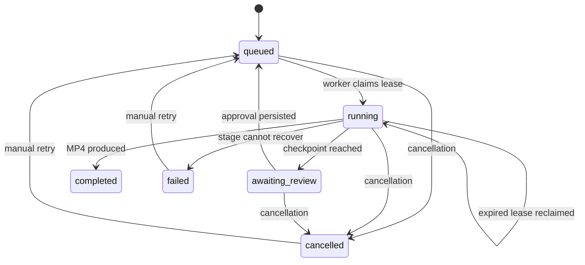

# Architecture and recovery

FrameForge combines a FastAPI service, a browser dashboard, a supervised workflow executor, provider adapters, FFmpeg rendering, and SQLite persistence. The default local mode starts the worker inside the API process. Redis mode separates the API and worker while both read the same local database and artifact storage.

## Workflow stages

| Stage | Responsibility | Persisted result |
| --- | --- | --- |
| `concept` | Turn the brief into a creative direction | Concept document |
| `script` | Produce the narration script | Script text |
| `scenes` | Divide the script into timed scenes and visual prompts | Validated scene plan |
| `visuals` | Acquire stock footage, generate a visual, or prepare a replaceable draft | Scene media, source credits, and provenance |
| `voice` | Produce scene narration audio | Audio files and speech availability |
| `subtitles` | Fit scene time to natural narration and estimate caption timing | Updated scene plan, duration, and subtitle file |
| `validate` | Check required media before composition | Validation event and stage checkpoint |
| `compose` | Normalize and combine scenes, speech, optional music, transitions, and subtitles | Final MP4 |

When reviews are enabled, the executor pauses after scene planning and again after visuals and voice have been generated, before subtitles, validation, and composition. Free studio always requires both reviews. Approvals persist, so a process restart does not bypass a checkpoint. Plan review supports script and scene edits. Scene IDs must be unique, scene durations must sum to the requested duration within 0.5 seconds, and narration must remain consistent with the edited script.

At media review, users can replace each scene visual or recording and add/remove music through bounded multipart uploads. Media changes invalidate downstream subtitle/validation/composition checkpoints. Free-mode draft visuals must be replaced before media approval is accepted. A changed recording keeps the existing scene text, so the recording should contain that narration; changing source text requires a revised production. On media approval, the API measures narration durations and adjusts scene timing without speeding up speech.

The live supervisor uses the Responses API to choose registered actions through function calling. The executor supplies current persisted state and permits only actions whose dependencies are satisfied. Model output cannot bypass review checkpoints or force arbitrary code execution. Free and demo modes choose eligible actions deterministically. Optional Gemini handles free-mode concept/script/scene content and narration; it does not choose workflow tools.

After plan approval, both visual generation and narration generation are eligible. The supervisor chooses their order; both must finish before media approval. Within each media stage, scene generation uses a concurrency limit of two and checkpoints individual completed assets so a stage retry can reuse them.

## Job state

The job document stores its request, current stage, completed stages, approval flags, scene metadata, artifact references, stage attempt counts, and timings. Event records provide a durable chronological account. API responses omit internal workflow state while exposing relevant progress, completed stages, attempts, and timings.

## Persistence and ownership

SQLite uses WAL mode. Job claiming and state mutations use transactions. A worker claims an eligible queued job or a running job whose lease has expired. Leases last 60 seconds and are renewed approximately every 10 seconds. State writes performed by a worker require current lease ownership. Cancellation or lease expiry prevents a stale worker from advancing the persisted job.

SQLite is the authoritative queue in both modes. Redis notifications merely wake workers. Workers reconcile the database, so losing a notification does not delete the durable job. The Redis Compose setup shares the database and artifacts between processes on one machine; it does not provide a database for geographically distributed workers.

Completed stages are skipped when a job resumes. An interrupted stage can run again. If the process dies after a provider produces output but before that output is checkpointed, a second external call may occur. This is at-least-once recovery; the project does not claim exactly-once execution or billing. Workers preserve completed work when the user retries a failed or cancelled job.

Each stage has a bounded attempt count controlled by `MAX_STAGE_ATTEMPTS`, with short exponential delays between failed attempts. Supervisor errors use the next dependency-safe action and record a warning. Demo and keyless free speech can fall back to a reported silent audio track. Configured Gemini, Pexels, and live-provider failures remain visible and fail the job after retries; they do not trigger a paid provider fallback. Missing Pexels configuration is a separate path that creates marked drafts for upload replacement.

When validation finds missing or corrupt media, it invalidates affected asset checkpoints and routes execution back to the media stages. Valid scene assets remain cached. Corrupt scene pairs are regenerated together. The workflow reopens media approval when review checkpoints are enabled. Automatic media repair is limited to two rounds per job; persistent validation failures then fail the job. Events and artifact provenance record the paths actually taken.

## Media sources and free studio

| Mode | Planning | Visuals | Narration |
| --- | --- | --- | --- |
| Free, no keys | Editable topic templates | Marked draft cards replaced by user uploads | Local system speech or uploaded recordings |
| Free, Pexels configured | Same templates or optional Gemini | Relevant Pexels MP4 clips or user uploads | Local speech, optional Gemini, or uploaded recordings |
| Free, Gemini configured | Structured Gemini concepts, scripts, and scenes | Pexels when configured; otherwise uploads replace drafts | Gemini neural speech or uploaded recordings |
| Demo | Deterministic templates | Local illustrated cards | Local system speech |
| Live | OpenAI Responses API | OpenAI images or configured external video endpoint | OpenAI speech |

Local speech tries Windows `System.Speech`, then `espeak`, then an explicitly flagged silent WAV. Docker includes `espeak`. Pexels metadata records source and contributor links plus license information; the app's artifact/review data exposes those credits. Gemini integration uses allowlisted free-tier-eligible text and TTS models, with serial pacing of speech requests on each worker loop. It sends no Gemini image, Veo, batch, or search-grounding requests. Whether a call is free still depends on the Google project's billing tier, quota, and model availability.

`POST /api/samples/coffee` imports a prepared 16-second media-review job. Existing AI-generated coffee images, locally recorded Zira speech, and an original score ship with the application. Importing this sample makes no new image, voice, or stock API calls; users can replace its assets before composition. It is an example of curated media, not evidence that an unconfigured free job can generate new photorealistic images.

Media uploads are inspected before checkpointing. Visuals are limited to 25 MB and PNG/JPEG/WebP/MP4/WebM; audio is limited to 15 MB and WAV/MP3/M4A/OGG. Audio is converted into local PCM WAV. Narration is bounded at 60 seconds per recording, music at 300 seconds, and visual clips at 180 seconds. Server-generated filenames prevent user filenames from becoming filesystem paths. Updates are permitted only while the job remains at media review.

## Composition and timing

FFmpeg crops/scales source assets into 1280×720 landscape, 720×1280 portrait, or 720×720 square, then produces H.264 video and AAC audio in a browser-playable MP4. Video clips are trimmed or looped to their scene duration; their original audio is discarded in favor of the selected narration and music. Stills use small, varied zoom/pan movements. The `fade` transition applies a short fade to/from black at scene boundaries; `cut` omits those fades. This is not an overlapping cross-dissolve.

Timing fitting reserves each measured narration's natural length plus 0.3 seconds of breathing room. Remaining time is distributed among visual pauses to retain the requested total when possible. If speech needs more time, the total grows up to 60 seconds and is persisted in the job/scene plan. Longer narration receives an actionable error asking for a shorter script or recording. The renderer never uses speech acceleration to force narration into a scene.

Captions divide scene text into short groups and estimate their times across the measured speech span; scene offsets still follow the fitted visual plan. This does not transcribe uploaded speech or produce word-aligned timestamps. Captions are burned into the video and retained as a separate SRT plus an MP4 subtitle stream.

Voice uses loudness normalization with a −16 LUFS target. Optional music loops at a low level, fades in/out, and is ducked by a compressor driven by the narration. The prepared sample includes an original score; other jobs use uploaded music. Validation catches missing or unusable assets before composing the video, and the job record identifies actual media providers.

Composition has a shared 270-second deadline across scene rendering and final mux/mix operations. Filter execution is constrained and output resolution stays at 720p to keep the workload practical on the deployed Render free instance (512 MB RAM, 0.1 CPU). Long jobs or large source clips can still exceed the deadline; local or larger workers provide more rendering capacity.

## Observability

The dashboard polls job state and displays stage progress, review content, scene asset replacement, music controls, source credits, events, artifacts, and the final video. API event records persist in SQLite. Export metadata reports music use, transition style, natural narration pacing, and estimated caption timing. `/metrics` exposes job counts by status plus accumulated stage attempts and elapsed stage time. These metrics support inspection; the project does not invent latency benchmarks, cost savings, generation quality scores, or business impact.

## Running and maintaining it

For local mode, the launchers start `uvicorn app.main:app` bound to loopback. For Redis mode, run the API with `QUEUE_BACKEND=redis` and run `python -m app.worker` against the same storage. The worker command owns leasing and execution; the API accepts requests and serves results.

Back up the SQLite database together with its artifact directory. When using a filesystem copy, stop API and worker processes first so SQLite WAL files and media are copied consistently. Keep API keys outside backups intended for sharing. Do not delete the Docker volume if you want to preserve the job history.

The Render deployment runs one Docker container with the embedded worker and SQLite. Its free filesystem is ephemeral; jobs and uploads can disappear on sleep, restart, or redeployment, so download outputs to retain them. Docker Compose uses a named volume instead. Neither setup runs local AI image/video models.

No authentication or tenancy controls are built in. Public demo visitors share the production list and review controls. A production deployment would require authentication, quotas, object storage, a database suited to the deployment topology, billing-aware idempotency, retention policies, and provider-specific operational controls.
