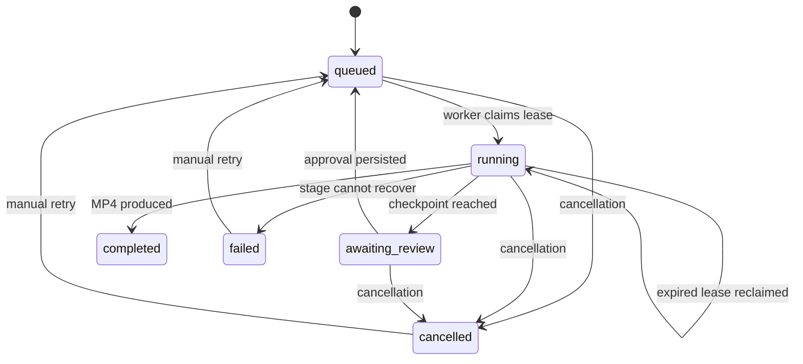

# Architecture and recovery

FrameForge combines a FastAPI service, a browser dashboard, a supervised workflow executor, provider adapters, FFmpeg rendering, and SQLite persistence. The default local mode starts the worker inside the API process. Redis mode separates the API and worker while both read the same local database and artifact storage.

## Workflow stages

| Stage | Responsibility | Persisted result |
| --- | --- | --- |
| `concept` | Turn the brief into a creative direction | Concept document |
| `script` | Produce the narration script | Script text |
| `scenes` | Divide the script into timed scenes and visual prompts | Validated scene plan |
| `visuals` | Generate or acquire a visual asset for each scene | Scene media and provenance |
| `voice` | Produce scene narration audio | Audio files and speech availability |
| `subtitles` | Generate timed subtitle content | Subtitle file |
| `validate` | Check required media before composition | Validation event and stage checkpoint |
| `compose` | Normalize and combine scenes, audio, and subtitles | Final MP4 |

When reviews are enabled, the executor pauses after scene planning and again after visuals and voice have been generated, before subtitles, validation, and composition. Approvals persist, so a process restart does not bypass a checkpoint. Plan review supports script and scene edits. Scene IDs must be unique, scene durations must sum to the requested duration within 0.5 seconds, and narration must remain consistent with the edited script. Media review approves existing media; changing source text at this point would require regenerating dependent assets.

The live supervisor uses the Responses API to choose registered actions through function calling. The executor supplies current persisted state and permits only actions whose dependencies are satisfied. Model output cannot bypass review checkpoints or force arbitrary code execution. Demo mode chooses actions deterministically, making the orchestration easy to demonstrate without credentials.

After plan approval, both visual generation and narration generation are eligible. The supervisor chooses their order; both must finish before media approval. Within each media stage, scene generation uses a concurrency limit of two and checkpoints individual completed assets so a stage retry can reuse them.

## Job state

The job document stores its request, current stage, completed stages, approval flags, scene metadata, artifact references, stage attempt counts, and timings. Event records provide a durable chronological account. API responses omit internal workflow state while exposing relevant progress, completed stages, attempts, and timings.

## Persistence and ownership

SQLite uses WAL mode. Job claiming and state mutations use transactions. A worker claims an eligible queued job or a running job whose lease has expired. Leases last 60 seconds and are renewed approximately every 10 seconds. State writes performed by a worker require current lease ownership. Cancellation or lease expiry prevents a stale worker from advancing the persisted job.

SQLite is the authoritative queue in both modes. Redis notifications merely wake workers. Workers reconcile the database, so losing a notification does not delete the durable job. The Redis Compose setup shares the database and artifacts between processes on one machine; it does not provide a database for geographically distributed workers.

Completed stages are skipped when a job resumes. An interrupted stage can run again. If the process dies after a provider produces output but before that output is checkpointed, a second external call may occur. This is at-least-once recovery; the project does not claim exactly-once execution or billing. Workers preserve completed work when the user retries a failed or cancelled job.

Each stage has a bounded attempt count controlled by `MAX_STAGE_ATTEMPTS`, with short exponential delays between failed attempts. Supervisor errors use the next dependency-safe action and record a warning. Demo speech can fall back to a reported silent audio track. Live generation failures remain visible and fail the job after retries; they do not become demo assets.

When validation finds missing or corrupt media, it invalidates affected asset checkpoints and routes execution back to the media stages. Valid scene assets remain cached. Corrupt scene pairs are regenerated together. The workflow reopens media approval when review checkpoints are enabled. Automatic media repair is limited to two rounds per job; persistent validation failures then fail the job. Events and artifact provenance record the paths actually taken.

## Media and rendering

Demo mode creates illustrated cards locally. It attempts offline narration through Windows `System.Speech`, then `espeak`, then produces a silent WAV marked as containing no speech. Live mode uses configured generation providers. The optional video adapter can supply scene clips instead of still images.

FFmpeg normalizes source assets for the selected aspect ratio, combines scene durations and audio, and creates a browser-playable MP4. Subtitle content is retained as a separate artifact as well as being used in composition. Validation catches missing or unusable assets before composing the video. The job record identifies which providers supplied its artifacts.

## Observability

The dashboard polls job state and displays stage progress, review content, events, artifacts, and the final video. API event records persist in SQLite. `/metrics` exposes job counts by status plus accumulated stage attempts and elapsed stage time. These metrics support local inspection; the project does not invent latency benchmarks, cost savings, generation quality scores, or business impact.

## Running and maintaining it

For local mode, the launchers start `uvicorn app.main:app` bound to loopback. For Redis mode, run the API with `QUEUE_BACKEND=redis` and run `python -m app.worker` against the same storage. The worker command owns leasing and execution; the API accepts requests and serves results.

Back up the SQLite database together with its artifact directory. When using a filesystem copy, stop API and worker processes first so SQLite WAL files and media are copied consistently. Keep API keys outside backups intended for sharing. Do not delete the Docker volume if you want to preserve the job history.

No authentication, tenancy controls, or public deployment hardening are built in. The local service is suited to a portfolio demonstration and further development. A production deployment would require authentication, quotas, object storage, a database suited to the deployment topology, billing-aware idempotency, retention policies, and provider-specific operational controls.
